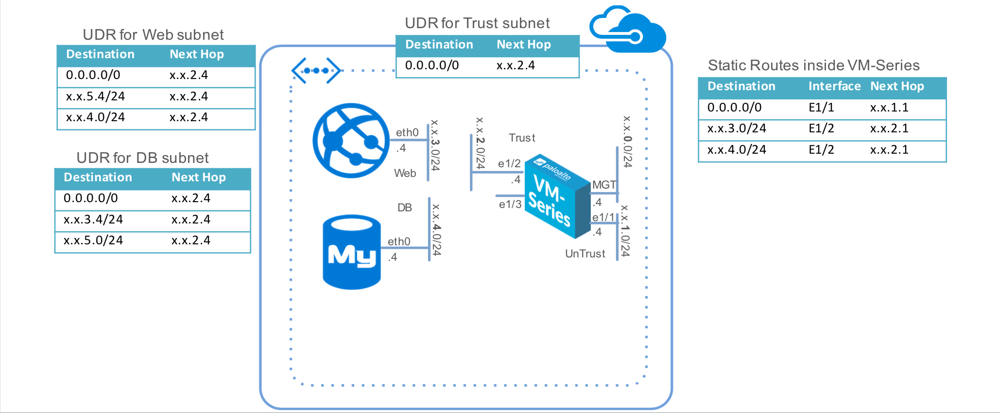

# Deploying Palo Alto Firewall on Azure

> **Difficulty**: Intermediate (assumes basic familiarity with Azure and Networking)

> **Time**: Approximately 75 minutes

This lab guide aims to provide users with a hands-on experience in deploying the Palo Alto Network Firewall on the Azure environment - a simple, two-tiered application framework including a VM-Series firewall. At the end of this lab, the users should have experience in creating and configuring Azure Resource Group which comprises of Azure Virtual Network (VNET), Availability Set (AvSet), Azure Load Balancer (ALB), User Defined Routes (UDR) and the Palo Alto Networks Firewall.

The following is the network diagram of this lab. We will attempt to build this in the Azure environment. The ARM template includes the following components to help deploy the firewall as a gateway for Internet-facing applications— a VM-Series firewall, and two Linux virtual machines that are configured as a WordPress server and MySQL server respectively (representing a two-tier application environment). The template also includes the functions to create the VNet and subnets within the resource group, and adds the necessary user-defined routes (UDRs) and IP forwarding flags to enable the VM-Series firewall to secure the Azure resource group.

# Lab Instructions
Please follow the lab instruction here: [APAC Azure Deployment Lab Guide](lab.pdf)

# Cleaning Up

Once you are done with the lab, unless you want to continue with these resources in Azure you can delete them.

1. In the browser, go to the **<a target="_blank" href="https://portal.azure.com/">Azure Portal</a>** (<a target="_blank" href="https://portal.azure.com/">https://portal.azure.com</a>), and click on the "**Resource Groups**", select the "***&lt;name&gt;group***" and on the "**Overview**" page, review its contents.  When you are ready, click the "**Delete**" button along the top.

1. On the "**Are you sure...**" page, enter your resource group name into the "**TYPE THE RESOURCE GROUP NAME**" box, and click the "**Delete** button along the bottom. Depending on how many resources are in the group, it may take a while for the deletion to complete.

    ***BE AWARE! WHEN YOU DELETE THE RESOURCE GROUP ALL OF THE RESOURCES IN IT WILL BE DELETED AS WELL.  MAKE SURE YOU ARE DELETING THE CORRRECT RESOURCE GROUP AND THAT YOU INTEND TO DELETE ALL THE RESOURCES IN THE GROUP BEFORE PROCEEDING.***

1. It's possible that some tiles will be left on your dashboard event after deleting the resources they represent.  You can remove them yourself just by hovering over them with your mouse, clicking on the ellipsis ("**...**") and choosing "**Unpin from dashboard**".

1. After deleting the resource group and all the resources that were provisioned in this lab, you won't have recurring charges or resource utilitization related to the work you did here.